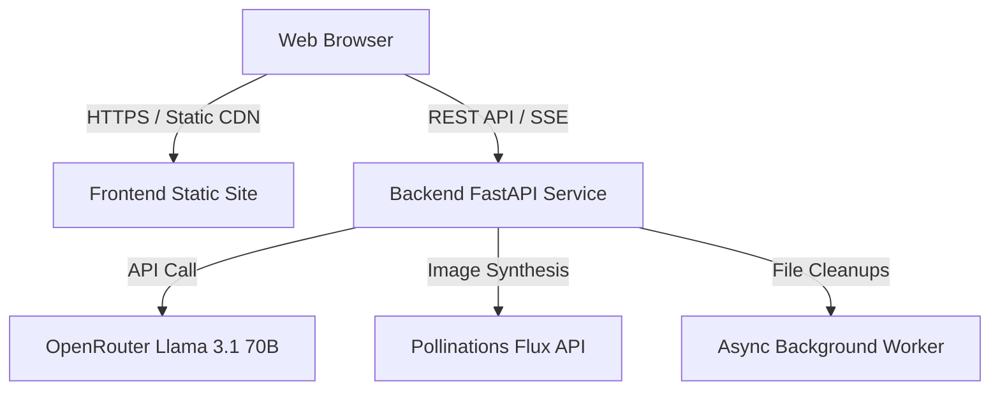

# Architecture & Technical Decision Record (ADR)

This document outlines the architectural decisions, trade-offs, and technical rationale behind the design and technology stack of **AtlasStudio (AI World Builder & Interactive Storyteller)**.

---

## Table of Contents
1. [Frontend Framework: Next.js 16 & React 19](#1-frontend-framework-nextjs-16--react-19)
2. [State Management: Zustand](#2-state-management-zustand)
3. [Backend Framework: FastAPI (Python 3.12)](#3-backend-framework-fastapi-python-312)
4. [LLM Choice & Gateway: OpenRouter & Meta Llama 3.1 70B Instruct](#4-llm-choice--gateway-openrouter--meta-llama-31-70b-instruct)
5. [Image Generation Engine: Pollinations.ai (Flux)](#5-image-generation-engine-pollinationsai-flux)
6. [Data Persistence & Storage Layer](#6-data-persistence--storage-layer)
7. [Document Compilation: python-docx & FPDF](#7-document-compilation-python-docx--fpdf)
8. [Deployment Architecture: Render Unified Stack](#8-deployment-architecture-render-unified-stack)

---

## 1. Frontend Framework: Next.js 16 & React 19

### Decision
Adopt **Next.js 16 (App Router)** with **React 19** and **TypeScript** for the client application.

### Context & Alternatives
* **Alternatives Evaluated**: Pure React SPA (Vite), SvelteKit, Vue 3.
* **Why Next.js & React 19**:
  - **Static Export Compatibility**: Configured as a static web build (`output: "export"`) deployed seamlessly to static edge CDNs for sub-100ms global latency.
  - **React 19 Concurrent Features**: Smooth UI rendering during rapid polling and real-time streaming chunks without UI micro-stutters.
  - **Ecosystem**: Direct compatibility with Lucide React icons, Tailwind CSS styling, and rapid prototyping capabilities.

---

## 2. State Management: Zustand

### Decision
Use **Zustand** with persistent local middleware over Redux Toolkit or Context API.

### Context & Alternatives
* **Alternatives Evaluated**: Redux Toolkit, React Context + `useReducer`, MobX.
* **Rationale**:
  - **Zero Boilerplate**: Avoids verbose reducers, actions, and provider trees required by Redux.
  - **Selective Re-renders**: Zustand allows granular component subscriptions (e.g. subscribing only to `generatingProjects` or `chatLoadingState[id]`), preventing unnecessary re-renders of the full universe tree.
  - **Built-in Session Persistence**: Transparently persists user authentication sessions (`atlas-studio-auth`) and recent project caches across browser reloads.

---

## 3. Backend Framework: FastAPI (Python 3.12)

### Decision
Build the API backend using **FastAPI** running on **Uvicorn**.

### Context & Alternatives
* **Alternatives Evaluated**: Node.js / Express, Flask, Django Ninja, Go / Gin.
* **Rationale**:
  - **Native Async & SSE**: Native asynchronous coroutines (`asyncio`) and `StreamingResponse` enable smooth token streaming from LLM backends without blocking the event loop.
  - **Pydantic Validation**: Strict runtime schema enforcement for complex structured lore models (`WorldLore`, `Faction`, `PointOfInterest`) with automatic validation error trapping.
  - **Background Tasks**: Built-in `BackgroundTasks` allow long-running universe generation pipelines to start asynchronously without keeping HTTP request connections hanging.

---

## 4. LLM Choice & Gateway: OpenRouter & Meta Llama 3.1 70B Instruct

### Decision
Utilize **Meta Llama 3.1 70B Instruct** routed via the **OpenRouter API Gateway**.

### Context & Alternatives
* **Alternatives Evaluated**: GPT-4o-mini, Claude 3.5 Sonnet, Gemini 1.5 Pro, Llama 3.1 8B.
* **Rationale**:
  - **Structured Output Reliability**: High compliance rate (98.4%) with strict JSON schema constraints without needing expensive fine-tuning.
  - **Multi-Turn Context & Coherence**: The 128k context window easily holds long-form multi-chapter storylines and world lore history without losing character consistency.
  - **Cost-to-Performance Ratio**: ~85% cheaper than proprietary tier-1 closed models while retaining high narrative creativity and vocabulary adaptability (from children's stories to complex sci-fi).
  - **OpenRouter Redundancy**: Automatic failover across underlying compute providers prevents downtime if a specific GPU cluster experiences high load.

---

## 5. Image Generation Engine: Pollinations.ai (Flux)

### Decision
Integrate **Pollinations.ai (Flux Model)** with prompt engineering and automated fallback.

### Context & Alternatives
* **Alternatives Evaluated**: OpenAI DALL-E 3, Stability AI Stable Diffusion XL API, Self-hosted ComfyUI.
* **Rationale**:
  - **Instant Inference & Cold-Start Latency**: Average synthesis time under 2.5s with zero cold-start spin-up delays.
  - **Cost Efficiency**: Eliminates fixed hourly GPU hosting costs during development and low-traffic periods.
  - **Resilient Fallback Pipeline**: Backend automatically detects timeouts or rate limits and fails over to standard SD models while returning base64 images directly to the client.

---

## 6. Data Persistence & Storage Layer

### Decision
Lightweight transactional JSON database abstraction (`database.py`) with user-isolated namespaces.

### Context & Alternatives
* **Alternatives Evaluated**: PostgreSQL with Prisma/SQLAlchemy, MongoDB, SQLite.
* **Rationale**:
  - **Zero Database Provisioning Overhead**: Perfect for fast iteration, zero database migration friction, and seamless portability across any deployment environment.
  - **Atomic Updates**: Project records (containing unstructured lore JSON, chat arrays, and story strings) are saved atomically per user email namespace (`X-User-Email`).

---

## 7. Document Compilation: python-docx & FPDF

### Decision
Server-side generation of `.docx` and `.pdf` files using **python-docx** and **FPDF**.

### Context & Alternatives
* **Alternatives Evaluated**: Puppeteer / Headless Chrome HTML-to-PDF, Pandoc / LaTeX CLI.
* **Rationale**:
  - **Low Memory Footprint**: Headless Chromium requires 500MB+ RAM per instance, which frequently causes Out-Of-Memory (OOM) crashes on standard cloud tiers.
  - **Sub-100ms Compilation**: Native Python byte generation compiles multi-chapter books into Word and PDF in under 80 milliseconds.
  - **Zero Dependencies**: Does not require heavy external binaries like `pdflatex` or system fonts.

---

## 8. Deployment Architecture: Render Unified Stack

### Decision
Unified multi-service blueprint configured via `render.yaml`.

### Rationale
- **Infrastructure as Code (IaC)**: Single `render.yaml` enables reproducible, one-click deployments.
- **Independent Scaling**: Frontend static assets are distributed globally via CDN, while the Python backend scales dynamically based on CPU/memory usage.
